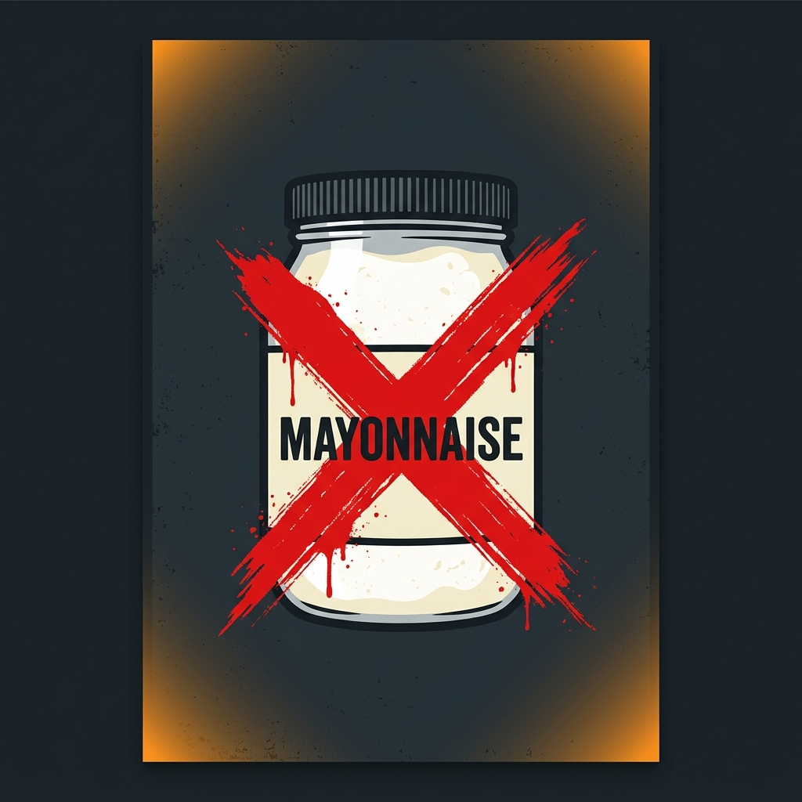
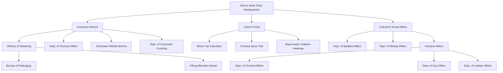

<div align="center">
  

  # 🥟 Momo Janta Party (MJP) 🚩
  ### *"Steaming Ahead to a Better Tomorrow!"*

  <p>
    
    
    
  </p>

  <p align="center">
    <strong>For too long, the people have been fed empty promises.</strong><br>
    Like momos with too much dough and no filling, previous governments have left us hungry and unsatisfied. <br>
    The MJP promises a government that is fully stuffed with action, transparency, and authentic flavor.
  </p>
</div>

<br>

<div align="center">
  
</div>

---

## 🌶️ Section I: Our Core Philosophy
We stand for **Equality, Steamed Progress, and Spicy Justice**. No citizen should be left behind, and no momo should ever be served cold. We believe that true governance, much like a perfect momo, requires the exact balance of a soft exterior and a rich, substantial filling.

> 🚨 **ZERO TOLERANCE FOR MAYONNAISE:** The MJP officially recognizes mayonnaise as a crime against street food. The Chutney Regulation Act is in full effect across all territories. Violators will be sent to the Ministry of Steaming for immediate re-education.

---

## 🏛️ Section II: Explore The Digital Headquarters
Our repository isn't just code. It is the beating heart of a culinary revolution. We have designed a state-of-the-art web platform to serve the citizens.

### 1️⃣ The Manifesto (`index.html`)
The landing page features a gorgeous, glassmorphism-inspired UI with saffron accents. Read our key pledges, including the **Universal Basic Momo (UBM)** and **Fried Momo Weekends**.

### 2️⃣ The Party Office (`office.html`)
Become an official comrade! Sign the register, state your preferred momo filling, and declare your spice tolerance. 
*Interactive feature powered by TypeScript: Be warned, selecting spice level 0 (implying mayonnaise consumption) will trigger an automatic investigation!*

### 3️⃣ Citizen Portal (`portal.html`)
Interactive tools for the modern comrade!
- **🧾 Momo Tax Calculator:** Calculate your civic dues (payable in napkins).
- **🗺️ Bad Chutney Heatmap:** Live tracking of mayonnaise violations across the city. *(See below!)*
- **🌶️ The Chutney Spice Test:** Find out your rank. Are you a Mild Supporter or a Schezwan Supreme Leader?
- **🎶 National Anthem:** Stand up and press play on the official lo-fi anthem curated by the Dept. of Melody Affairs.

<br>

<div align="center">
  <table>
    <tr>
      <td align="center">
        <b>🚨 Tactical Heatmap (Live Mayo Tracking)</b><br>
        
      </td>
      <td align="center">
        <b>🖼️ MJP Official Propaganda</b><br>
        
      </td>
    </tr>
  </table>
</div>

---

## 🏢 Section III: Government Departments (`departments.html`)
The bureaucratic backbone of our great nation. We have decentralized power into highly specialized branches. Each department has its own dedicated dashboard to assign the Head and Vice Head.

| Department Icon | Department Name | Core Responsibility |
| :---: | :--- | :--- |
| ♨️ | **Ministry of Steaming** | Ensuring optimal temperature and softness standards for all bamboo baskets. |
| 🌶️ | **Dept. of Chutney Affairs** | Regulating spice levels and subsidizing red chilies. |
| 🥟 | **Filling Allocation Board** | Managing fair distribution of veg, paneer, pork, and chicken fillings. |
| 🥡 | **Bureau of Packaging** | Developing eco-friendly, un-soggy bamboo takeaway boxes. |
| ✊‍♀️ | **Dept. of Feminist Affairs** | Smashing the patriarchy one dumpling at a time; equal pay for vendors. |
| 👩‍❤️‍👩 | **Dept. of Lesbian Affairs** | Fostering inclusivity and guaranteeing love and momo-sharing are universal rights. |
| 🌈 | **Dept. of Gay Affairs** | Ensuring the momo selection is as colorful and diverse as our people. |
| 🌶️👩🏽 | **Schezwan Mahila Morcha** | The fiercest women's wing defending the spice tolerance of the nation. |
| 🪳🔨 | **Dept. of Cockroach Crushing** | Eradicating pests with extreme prejudice to maintain pristine street food hygiene. |

### 🔥 Spotlight: The Department of Baddies Affairs
Ensuring the nation always slays. Serving aesthetics and state-funded touch-ups.
<div align="center">
  
</div>

### 🍬 Special Mention: Dept. of Melody Affairs
<div align="center">
  
  <p>Dedicated exclusively to solving the nation's most pressing question: <em>"Melody itni chocolaty kyun hai?"</em></p>
</div>

---

## 📊 Section IV: Organizational Structure



---

## 💻 Section V: Developer Guide (Join the IT Cell)

This revolution is powered by modern, premium web technologies. If you wish to join the MJP IT Cell, follow these instructions:

### Tech Stack
- **HTML5 & Vanilla CSS** (Glassmorphism, dynamic gradients, CSS variables)
- **TypeScript** (Strict typing ensures our forms never break)
- **Modern Typography** (Outfit & Playfair Display fonts)

### Running Locally
1. Clone the repository.
2. If you edit any TypeScript files (e.g., `office.ts` or `portal.ts`), recompile them using:
   ```bash
   npx typescript tsc office.ts portal.ts
   ```
3. Open `index.html` in your favorite browser. No complex build tools or local servers required—just pure, steamed code.

---

<div align="center">
  <h3>🥟 In Steam We Trust. 🥟</h3>
  <i>Paid for by the Committee to Elect the MJP. Steaming Ahead Since 2026.</i>
</div>
